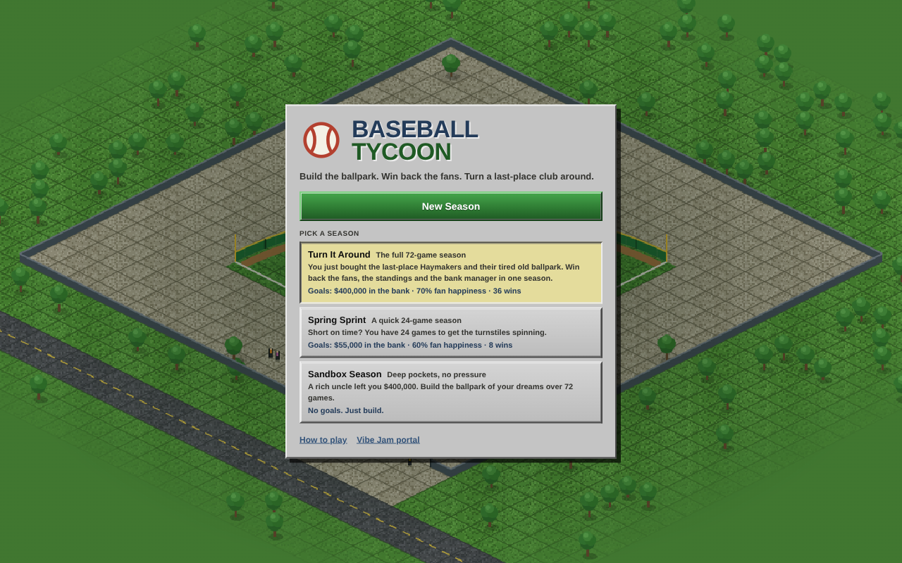
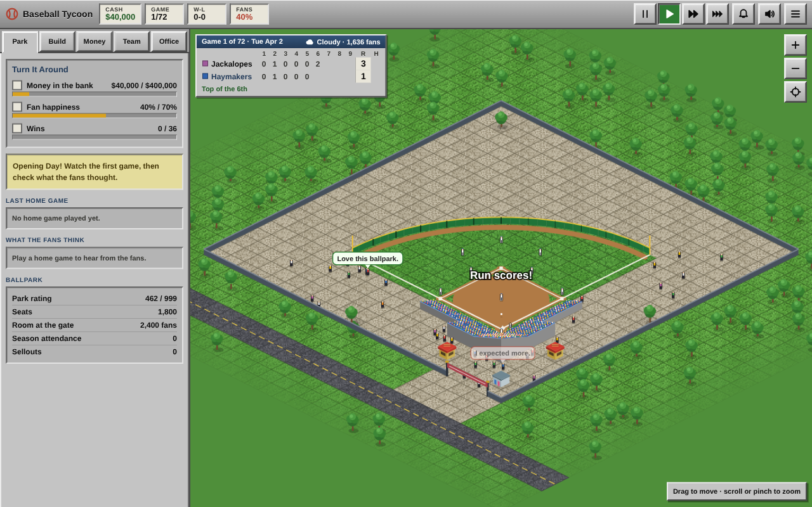
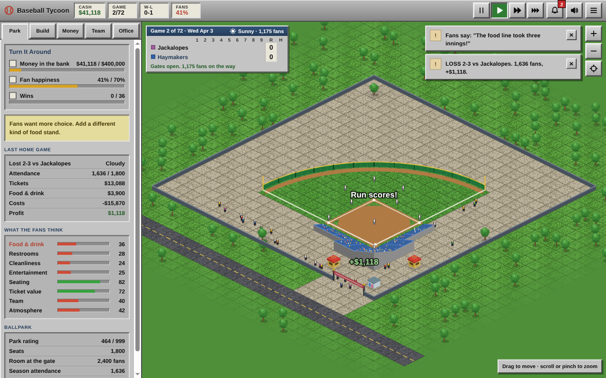
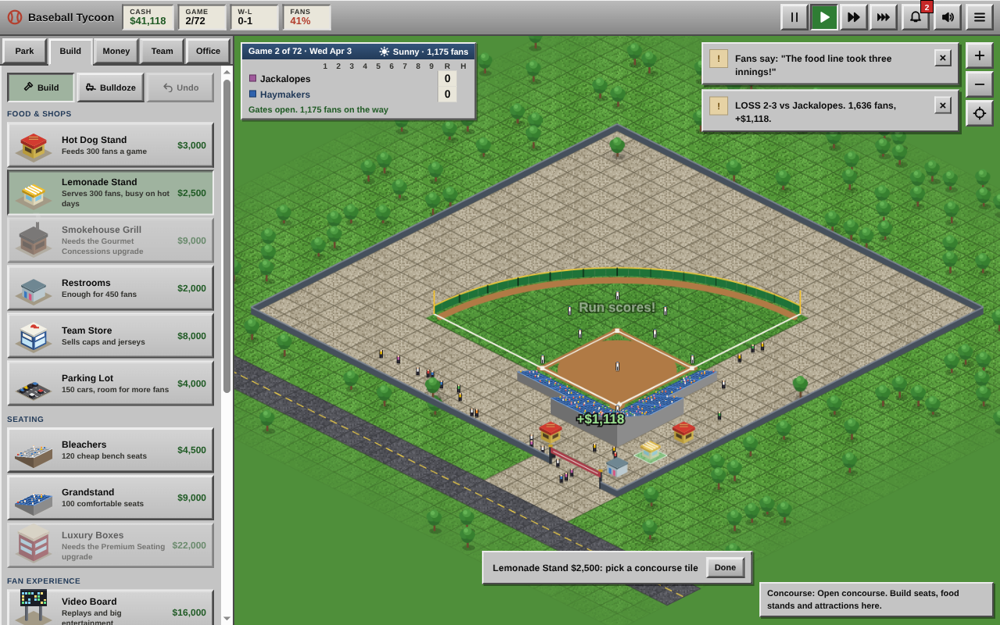
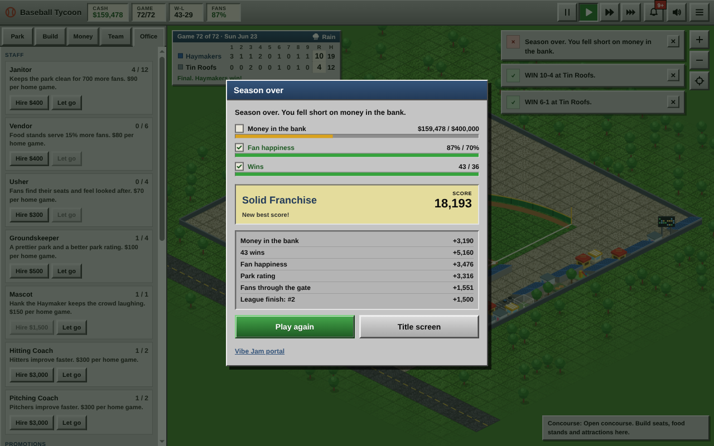
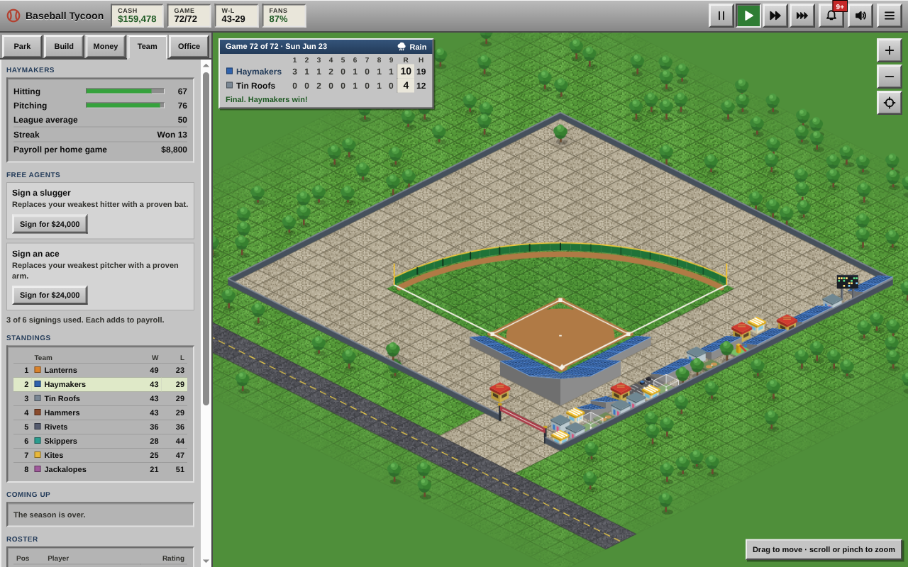
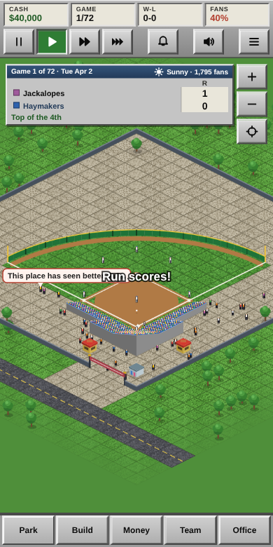

# Baseball Tycoon

Build the ballpark. Win back the fans. Turn a last-place club around.

You just bought the Harlow Creek Haymakers: the worst team in the eight-club Timberline League, playing in a tired old park. You have one 72-game season to fill the stands, keep the fans happy, build a winner and get the bank off your back.

A browser management sim: build the ballpark, price the tickets and run a minor-league baseball franchise. Original name, teams, art and sound. Everything is drawn and synthesized in code.



## How it plays

- **The season runs itself.** Every game plays out inning by inning on its own clock. Pause any time.
- **Fans tell you what is wrong.** After each home game the Park tab shows how fans rated food, restrooms, cleanliness, entertainment, seating, ticket value, the team and the atmosphere, plus one line of advice.
- **Build what they ask for.** 17 facilities: seating, food stands, restrooms, a team store, parking, a video board, a kids corner, light towers, a fountain, and team facilities that make your players better.
- **Set your prices.** Cheap tickets fill the park; greedy prices empty it. Menu prices trade money per sale against happy fans; gouging on food costs more than it earns.
- **Build a winner.** Batting cages, bullpens, a clubhouse, coaches and free agents turn losses into wins. Winning sells tickets.
- **Watch the money.** Payroll, upkeep, staff wages and game-day costs add up. The bank lends up to $100,000, and loans count against your money goal.
- **Win the season** by hitting all three goals by the last game: money in the bank, fan happiness and wins. Go broke and the bank takes the keys.

A final score and grade (Bush League up to Dynasty) is saved as your best for each season type.

| Season | Games | Goals |
|---|---|---|
| Turn It Around | 72 | $400,000 in the bank, 70% fan happiness, 36 wins |
| Spring Sprint | 24 | $55,000 in the bank, 60% fan happiness, 8 wins |
| Sandbox Season | 72 | None. Start with $400,000 and build |

## Screenshots

| Live game | Fan report |
|---|---|
|  |  |

| Building | Season over |
|---|---|
|  |  |

| Grown park | Phone |
|---|---|
|  |  |

## Controls

| Input | Action |
|---|---|
| Drag | Move the view |
| Scroll wheel / pinch | Zoom |
| Click a tile | Build or bulldoze |
| Tap a tile twice (touch) | Preview, then confirm |
| Space | Pause / resume (starts Opening Day) |
| 1 2 3 | Normal, fast, very fast |
| B / X / U | Build tool, bulldozer, undo |
| Arrows or WASD | Move the view |
| + / - | Zoom |
| M | Sound on or off |
| Esc | Close a window or put the tool away |

On phones the side panel becomes a bottom sheet. Tap the open tab again to fold it away.

## Run it

The game lives in `web/`.

```bash
cd web
npm install
npm run dev       # http://localhost:5174
npm test          # unit tests for the season, economy and actions
npm run build     # typecheck, then static build in web/dist/
npm run preview   # serve the build at http://localhost:8001
```

`web/dist/` is fully static (about 40 KB gzipped of JavaScript, no other downloads) and runs from any folder or subdomain. The only network request is the Vibe Jam widget script.

## How it is built

- Vite + TypeScript, no runtime dependencies.
- Hand-written 2D canvas isometric renderer. Tiles are baked once from a seeded noise pattern; buildings, players and fans are drawn with canvas shapes.
- Sound is synthesized with WebAudio: bat cracks, crowd noise, a ballpark organ riff.
- The sim is deterministic from a seed stored in the save, so a season replays the same way and the logic is unit tested.
- Autosaves to `localStorage` after every game.

Code map (`web/src/`):

- `season/` league, schedule, inning-by-inning game sim, roster and training
- `management/` economy (demand, attendance, revenue, costs), fan experience, game day, finance, staff, promotions, upgrades
- `actions/` every player action as a command with a check and an undo point
- `scenario/` season goals, win and lose rules, final score
- `render/`, `game/` isometric painting, camera, pointer and touch input
- `ui/` panels, scoreboard, notifications
- `audio/` synthesized sound

## Vibe Jam

The page includes the required `vibejam.com/2026/widget.js` script, loads straight into a playable title screen with no loading screen, and links to the jam portal. Arriving with `?portal=true` skips the title and drops you into a season; a `ref` link back to the previous game is shown on the title screen.

## License

[MIT](LICENSE)
